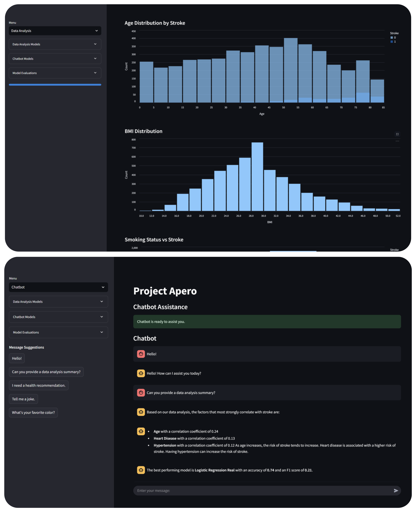
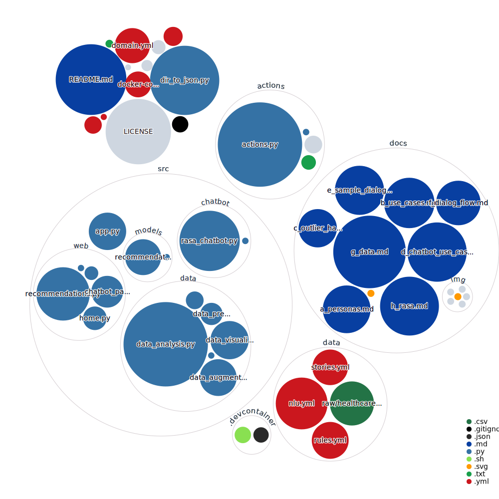

<!--
   Project Apero - Stroke Prediction Web App
   =========================================
   Production-Ready README for LinkedIn Presentation
   Inspired by Microsoft-style "Perfect README"
-->

<h1 align="center">
  
</h1>

<p align="center">
  [](https://github.com/codespaces/new?repo=HlexNC/Project-Arepo&machine=standardLinux32gb&devcontainer_path=.devcontainer/devcontainer.json)
</p>

<p align="center">
  <a href="https://github.com/HlexNC/Project-Arepo">
    
  </a>
  <a href="https://www.python.org/downloads/release/python-390/">
    
  </a>
  <a href="LICENSE">
    
  </a>
  <a href="https://www.docker.com/">
    
  </a>
</p>

<h4 align="center">
Project Apero is a comprehensive web application—originally developed as a university project—designed to help individuals assess their stroke risk and receive personalized recommendations. It leverages data analysis, machine learning, and a conversational chatbot interface to provide actionable health insights.
</h4>

---

## Table of Contents

- [Project Description](#project-description)
- [Screenshots](#screenshots)
- [Key Features](#key-features)
- [Installation](#installation)
  - [Prerequisites](#prerequisites)
  - [Steps to Get Started](#steps-to-get-started)
  - [Training the Rasa Chatbot (Optional)](#training-the-rasa-chatbot-optional)
- [Data Overview](#data-overview)
  - [Dataset](#dataset)
  - [Data Handling and Augmentation](#data-handling-and-augmentation)
- [Usage](#usage)
  - [Personalized Stroke Risk Assessment](#personalized-stroke-risk-assessment)
  - [Interactive Data Analysis](#interactive-data-analysis)
  - [Chatbot Assistance](#chatbot-assistance)
- [Project Structure](#project-structure)
- [Disclaimer](#disclaimer)
- [Repository Visualization](#repository-visualization)
- [License](#license)
- [Contact](#contact)

---

## Project Description

**Project Apero** provides an intuitive interface for users to input personal health metrics—such as age, gender, BMI, blood glucose levels, etc.—and receive an estimated probability of experiencing a stroke. It then offers evidence-based recommendations and insights to help reduce stroke risk.

The application is built using:
- **Streamlit** for the web front end
- **Scikit-Learn** for machine learning model training and prediction
- **Rasa** for an integrated chatbot
- **Docker** for containerization and ease of deployment

> **Why "Apero"?**  
> The project name is derived from a playful acronym referencing a healthy approach to “Assessing Personal Event Risks Online,” aiming to make preventative health measures more approachable.

---

## Screenshots



---

## Key Features

1. **Personalized Stroke Risk Assessment**
   - **Input Health Metrics**: Users provide personal data (e.g., age, gender, BMI, blood glucose levels, and more).
   - **Risk Probability**: The machine learning model calculates a stroke risk score (0.0 to 1.0).
   - **Actionable Recommendations**: Users receive suggestions tailored to their risk factors.

2. **Interactive Data Analysis & Visualization**
   - **Data Exploration**: Filter and explore health-related metrics to reveal trends and correlations.
   - **Visual Insights**: Interactive charts, heatmaps, and summary statistics enhance comprehension of stroke risk factors.

3. **Conversational Chatbot Assistance**
   - **Real-Time Queries**: A Rasa-powered chatbot answers questions about stroke risk, data insights, and wellness tips.
   - **Guided Interaction**: The chatbot can direct users to relevant pages, simplify data analysis steps, and deliver personalized feedback.

4. **Robust Data Handling and Augmentation**
   - **Outlier Detection**: Statistical methods to detect and remove anomalies.
   - **Synthetic Data Generation**: Augments the dataset by ~30% to improve model performance and generalization.

---

## Installation

### Prerequisites

- **Docker**  
  Make sure [Docker](https://www.docker.com/) is installed and running on your machine.
- **Git**  
  Required to clone the repository.
- **Python 3.9+ (Optional)**  
  If you want to run or modify components without Docker.

### Steps to Get Started

1. **Clone the Repository**  
   ```bash
   git clone https://github.com/HlexNC/Project-Arepo.git
   cd Project-Arepo
   ```

2. **Build and Run Docker Services**  
   ```bash
   docker-compose up --build
   ```
   - This command builds Docker images, trains machine learning models, and starts all necessary services.
   - The initial startup may take several minutes as the environment sets up.

3. **Access the Web Application**  
   - Open a web browser and go to: [http://localhost:8501](http://localhost:8501).
   - You will see the main page with navigation options for data analysis, personalized recommendations, and chatbot interaction.

> [!TIP]
> If you want to run or modify components without Docker, refer to the comments in the `docker-compose.yml` or optional instructions in the [`docs/`](./docs) folder (if provided).

### Training the Rasa Chatbot (Optional)

If you make changes to the chatbot’s training data or if the chatbot fails to respond:

1. **Open a terminal inside the Rasa server container**  
   ```bash
   docker exec -it rasa_server bash
   ```

2. **Train the Rasa Model**  
   ```bash
   rasa train
   ```

3. **Restart Services**  
   ```bash
   exit
   docker-compose down
   docker-compose up --build -d
   ```

---

## Data Overview

### Dataset

We utilize the publicly available [Stroke Prediction Dataset](https://www.kaggle.com/datasets/fedesoriano/stroke-prediction-dataset). This dataset includes key health metrics:

- Age, BMI, Glucose Levels
- Hypertension, Heart Disease
- Smoking Status, etc.

> [!NOTE]
> This dataset is used strictly for educational and demonstration purposes.

### Data Handling and Augmentation

- **Outlier Detection**: Employs a Z-score based method to filter anomalous data points.
- **Synthetic Data Augmentation**: Adds ~30% realistic synthetic data to boost model robustness and representation.
- **Feature Scaling**: Numerical features are normalized or standardized, aligning with best practices from [Google’s ML Crash Course](https://developers.google.com/machine-learning/crash-course).

---

## Usage

### Personalized Stroke Risk Assessment

1. **Navigate to "Personalized Recommendations"**  
   From the sidebar, select **Personalized Recommendations**.

2. **Provide Personal Health Metrics**  
   Enter details such as age, gender, BMI, glucose levels, hypertension status, etc.

3. **Receive Risk Probability & Recommendations**  
   The system displays a **stroke risk** (0.0 to 1.0) and personalized tips (e.g., diet, exercise, medical follow-up).

### Interactive Data Analysis

1. **Go to "Data Analysis"**  
   Choose **Data Analysis** from the sidebar.

2. **Explore and Visualize**  
   - Filter or query the dataset to inspect correlations and distributions.  
   - View generated charts, tables, or heatmaps.

3. **Model Training & Evaluation**  
   Train or re-train the underlying machine learning models (Logistic Regression, Random Forest, SVM) within the app. Evaluate performance via metrics like Accuracy, Precision, Recall, etc.

### Chatbot Assistance

1. **Select "Chatbot"**  
   Click on **Chatbot** in the sidebar to open the conversational assistant interface.

2. **Interact with the Rasa-Powered Chatbot**  
   - Ask questions about stroke risk or how to interpret certain metrics.  
   - Get immediate recommendations and clarifications on data analysis results.

---

## Project Structure

Below is a simplified overview of the repository layout:

```bash
Project-Arepo/
├── actions/
│   ├── actions.py              # Custom Rasa actions
│   ├── Dockerfile
│   └── requirements-actions.txt
├── data/
│   ├── data_analysis.py
│   ├── data_augmentation.py
│   ├── data_loader.py
│   ├── data_preprocessor.py
│   ├── raw/
│   │   └── healthcare-dataset-stroke-data.csv
│   └── processed/
├── src/
│   ├── app.py                  # Streamlit main entry point
│   ├── chatbot/
│   │   └── rasa_chatbot.py
│   └── web/
│       ├── home.py
│       ├── recommendations.py
│       ├── chatbot_page.py
│       └── data_analysis_page.py
├── models/
├── docs/
│   ├── img/
│   │   └── ASP_Banner.png
│   └── ...
├── docker-compose.yml
├── Dockerfile
├── requirements.txt
├── LICENSE
└── README.md
```

---

> [!WARNING]
> **Project Apero is not a substitute for professional medical advice, diagnosis, or treatment.**  
> The stroke risk assessments and recommendations are for **educational and research** purposes only. Always seek the advice of qualified healthcare professionals for any medical concerns.  
> Use of this application is entirely at your own risk, and the developers assume **no liability** for any actions taken based on its output.

---

## Repository Visualization

Below is an automatically generated repository structure diagram. The diagram is updated whenever changes are pushed to the main branch:

<p align="center">
  
</p>

---

## License

This project is licensed under the **GNU General Public License v3**.  
See the [LICENSE](LICENSE) file for details.

---

## Contact

For inquiries, feedback, or suggestions:
- **GitHub Issues**: [Project Apero Repository](https://github.com/HlexNC/Project-Arepo/issues)
- **Email**: Please refer to the repository maintainers’ profiles.

We welcome contributions! Feel free to open a pull request or start a discussion in our GitHub repository.
